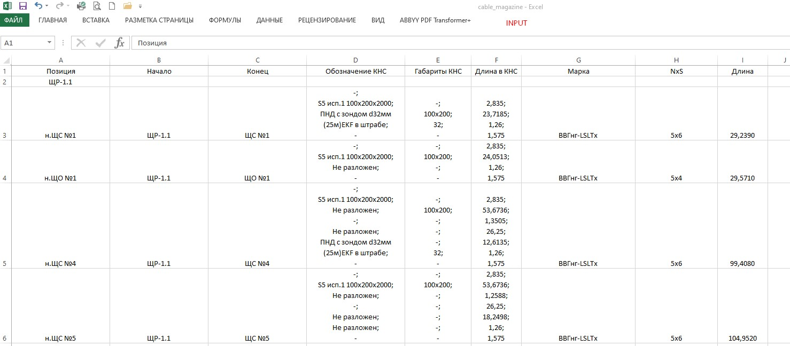
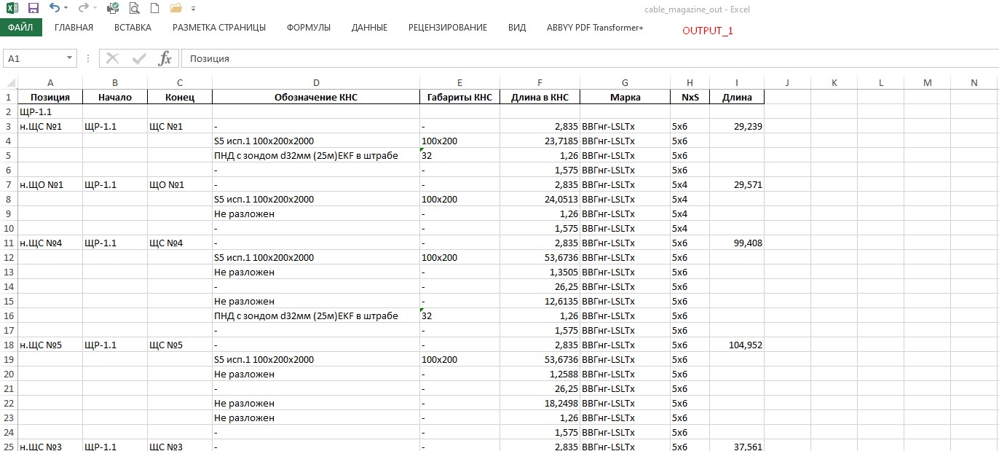
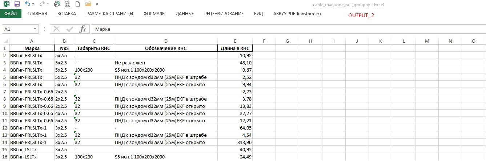

# Парсинг Excel-файла кабельного журнала выгруженного из NanoCAD (cable_magazine.xlsx),
# с разбивкой ячеек с данными "Обозначение КНС" по длинам кабелей в соответсвии с назначением (cable_magazine_out.xlsx)
# + доп.файл с суммированными 'Длинами в КНС' в группировке по 'Марка', 'NxS', 'Габариты КНС', 'Обозначение КНС' (cable_magazine_out_groupby.xlsx)

---

---

